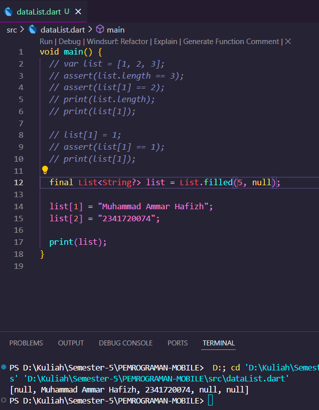
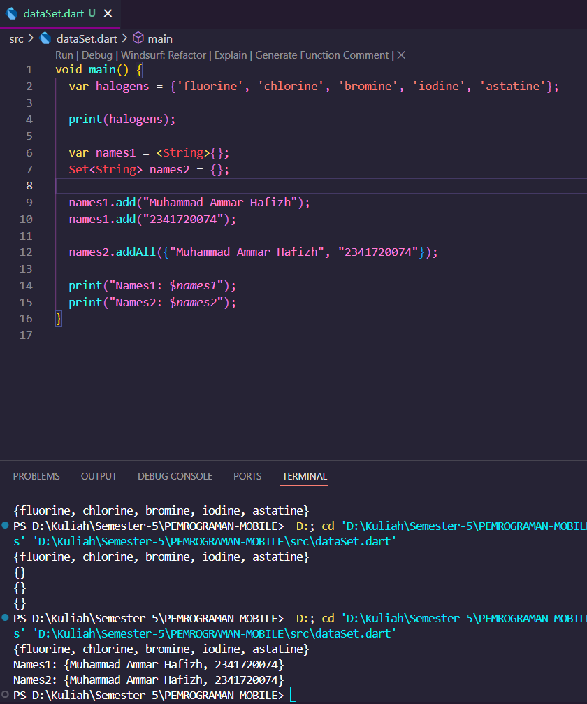
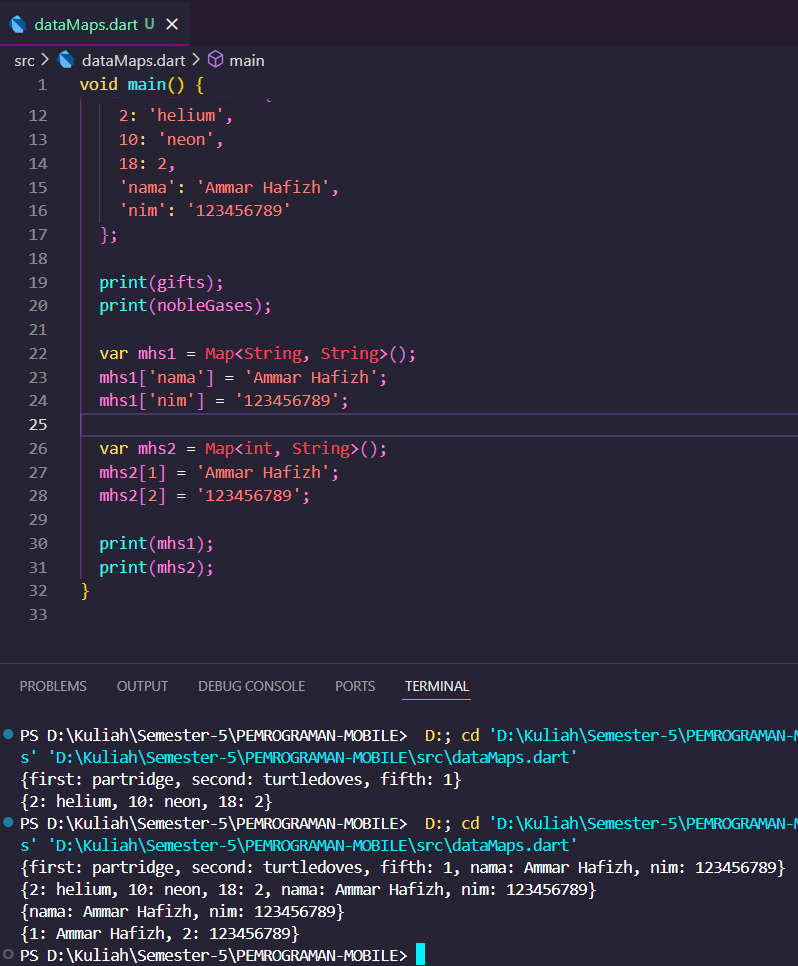
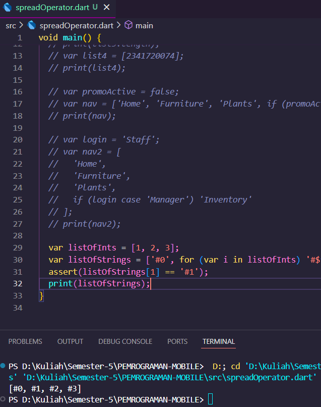
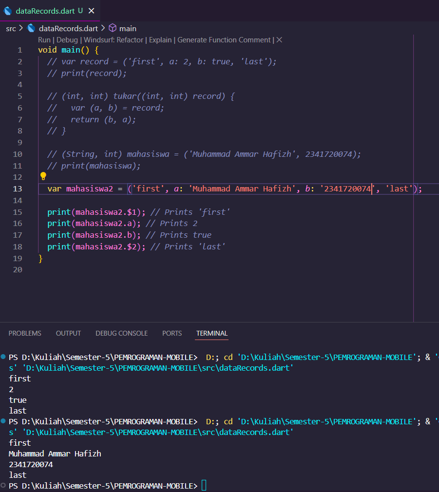

# 📝 Codelab 04 - Dart

## 👤 Identitas
- **Nama**  : Muhammad Ammar Hafizh  
- **NIM**   : 2341720074  
- **Kelas** : TI - 3F  

---

# 📌 Praktikum 1 – Data List

### ✅ Screenshot Praktikum 1


### 🔎 Penjelasan Praktikum 1
List pada dart sama dengan array pada pemrograman lain bisa kita lihat pada gambar di atas kita membuat 5 list atau 5 tempat dan berisikan null tetapi list 1 dan 2 saya masukan nama dan nim saya sendiri

# 📌 Praktikum 2 – Data Set 

### ✅ Screenshot Praktikum 2


### 🔎 Penjelasan Praktikum 2
Data Set pada dart merupakan data yang tidak bisa diduplikatkan dan tidak terurut

# 📌 Praktikum 3 – Data Maps 

### ✅ Screenshot Praktikum 3


### 🔎 Penjelasan Praktikum 3
Data Maps sama seperti list tetapi yang membedakannya adalah data maps memiliki key dan value pada data yang disimpannya.

# 📌 Praktikum 4 – Spread dan Control-flow Operators

### ✅ Screenshot Praktikum 4


### 🔎 Penjelasan Praktikum 4
Pada praktikum 4 kita mencoba eksperimen data set dari menggunakan data list lain untuk menjadi data dari list tersebut sampai mengubah semua data list menjadi aturan yang kita mau.

### ✅ Screenshot Praktikum 5


### 🔎 Penjelasan Praktikum 5
Pada praktikum 5 kita mencoba data record eksperimen untuk menukar data yang sudah ada ke data yang sudah ada lainnya.
---

# 🎯 Tugas Tambahan  

## 2. Functions dalam Dart
functions berfungsi sebagai blok kode untuk tugas tertentu, dapat dipanggil berulang.

## 3. Jelaskan jenis-jenis parameter di Functions beserta contoh sintaksnya!

### Positional Parameter
Parameter wajib yang urutannya harus sesuai ketika memanggil fungsi.  

```dart
void salam(String nama, int umur) {
  print("Halo $nama, umur $umur tahun");
}

void main() {
  salam("Muhammad Ammar Hafizh", 21);
}
```

### Optional Positional Parameter
Parameter wajib yang urutannya harus sesuai ketika memanggil fungsi.  

```dart
void salam([String? nama]) {
  print("Halo ${nama ?? "Mahasiswa"}");
}

void main() {
  salam();             // ✅ Output: Halo Mahasiswa
  salam("Hafizh");     // ✅ Output: Halo Hafizh
}
```

### Named Parameter
Parameter wajib yang urutannya harus sesuai ketika memanggil fungsi.  

```dart
void salam({required String nama, int umur = 0}) {
  print("Halo $nama, umur $umur tahun");
}

void main() {
  salam(nama: "Ammar", umur: 22);
}
```
## 4. First-Class Object
Dalam Dart, **Functions adalah first-class objects**.  
Artinya:
- Fungsi bisa **disimpan dalam variabel**.  
- Fungsi bisa **dikirim sebagai argumen** ke fungsi lain.  
- Fungsi bisa **dikembalikan sebagai nilai return** dari fungsi lain.  

Dengan ini, fungsi diperlakukan sama seperti objek biasa (String, int, List, dll).

---

## Contoh Sintaks
```dart
void cetakPesan(String pesan) {
  print(pesan);
}

void main() {
  var f = cetakPesan;   // simpan fungsi ke variabel
  f("Halo, saya Ammar Hafizh (2341720074)");
}
```

## 5. Anonymous Functions
**Anonymous Function** adalah fungsi yang **tidak memiliki nama**.  
Biasanya digunakan:
- Sebagai **fungsi sekali pakai**.  
- Untuk **callback** (misalnya di `forEach`, `map`, atau event handler).  
- Lebih ringkas dibanding membuat fungsi dengan nama.

---

## Contoh Sintaks
```dart
(var param1, var param2) {
  // isi fungsi
  return param1 + param2;
};
```

# 6. Perbedaan Lexical Scope dan Lexical Closures

## 1. Lexical Scope
Lexical scope adalah aturan penentuan **ruang lingkup variabel** berdasarkan tempat variabel tersebut didefinisikan dalam kode, bukan berdasarkan pemanggilan fungsi.

### Contoh:
```dart
void main() {
  var name = "Ammar";

  void sayHello() {
    print("Hello, $name"); // bisa akses 'name' karena scope luar
  }

  sayHello(); // Output: Hello, Ammar
}
```
## 2. Lexical Closures
Lexical closures adalah kemampuan sebuah fungsi untuk menangkap dan mengingat variabel dari scope di mana fungsi tersebut dibuat, meskipun fungsi itu dipanggil di luar scope asalnya.

### Contoh:
```dart
Function makeCounter() {
  var count = 0;

  return () {
    count++;
    return count;
  };
}

void main() {
  var counter = makeCounter();

  print(counter()); // 1
  print(counter()); // 2
  print(counter()); // 3
}
```

# 7. Return Multiple Value di Functions

Dalam Dart, sebuah fungsi hanya bisa langsung mengembalikan **satu nilai**.  
Namun, untuk mengembalikan **banyak nilai (multiple value)**, kita bisa menggunakan beberapa cara seperti:

---

## 1. Menggunakan `List`
```dart
List<int> getCoordinates() {
  return [10, 20];
}

void main() {
  var coords = getCoordinates();
  print("X: ${coords[0]}, Y: ${coords[1]}"); // Output: X: 10, Y: 20
}
```

## 2. Menggunakan `Map`
```dart
Map<String, dynamic> getStudent() {
  return {
    "name": "Ammar",
    "nim": "2341720074"
  };
}

void main() {
  var student = getStudent();
  print("Name: ${student['name']}, NIM: ${student['nim']}");
}
```

## 3. Menggunakan `Class atau Record`
```dart
class Result {
  final int min;
  final int max;

  Result(this.min, this.max);
}

Result findMinMax(List<int> numbers) {
  numbers.sort();
  return Result(numbers.first, numbers.last);
}

void main() {
  var result = findMinMax([5, 2, 9, 1]);
  print("Min: ${result.min}, Max: ${result.max}"); // Output: Min: 1, Max: 9
}
```

## 4. Menggunakan `Record`
```dart
(int, int) getRange() {
  return (1, 100);
}

void main() {
  var (start, end) = getRange();
  print("Start: $start, End: $end"); // Output: Start: 1, End: 100
}
```