# 📝 Codelab 03 - Dart

## 👤 Identitas
- **Nama**  : Muhammad Ammar Hafizh  
- **NIM**   : 2341720074  
- **Kelas** : TI - 3F  

---

# 📌 Praktikum 1 – Control Flows  

### ❌ Screenshot Error
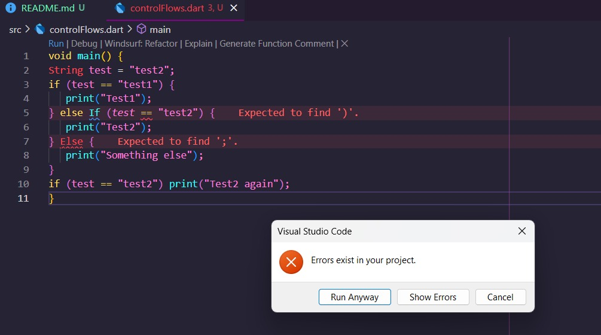

### 🔎 Penjelasan Error
Dart adalah bahasa yang **case sensitive**.  
Pada kode terdapat penulisan `Else` dan `If` dengan huruf besar yang salah, seharusnya `else` dan `if`.  
Karena itu program gagal dijalankan.

### ✅ Screenshot Perbaikan
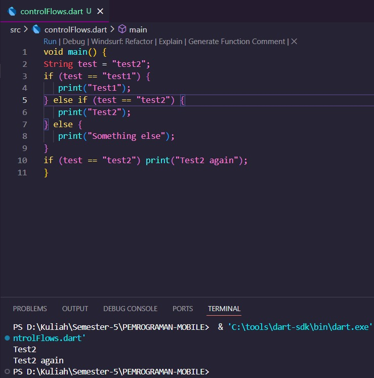

---

### ❌ Screenshot Error 2
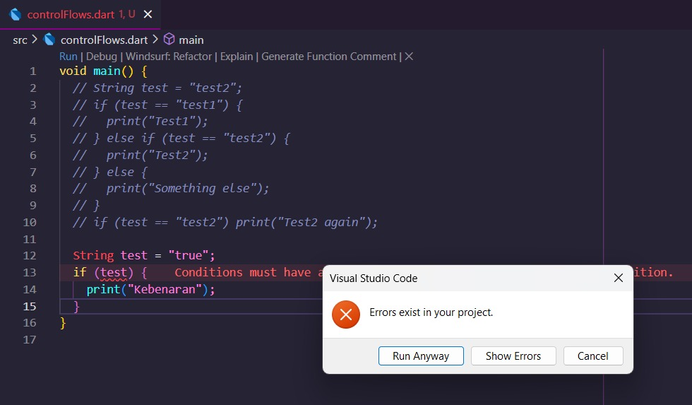

### 🔎 Penjelasan Error
Kesalahan ada pada **kondisi perulangan** yang tidak lengkap.  
Operator logika belum ditulis dengan benar sehingga kondisi tidak terbaca sempurna oleh Dart.

### ✅ Screenshot Perbaikan 2
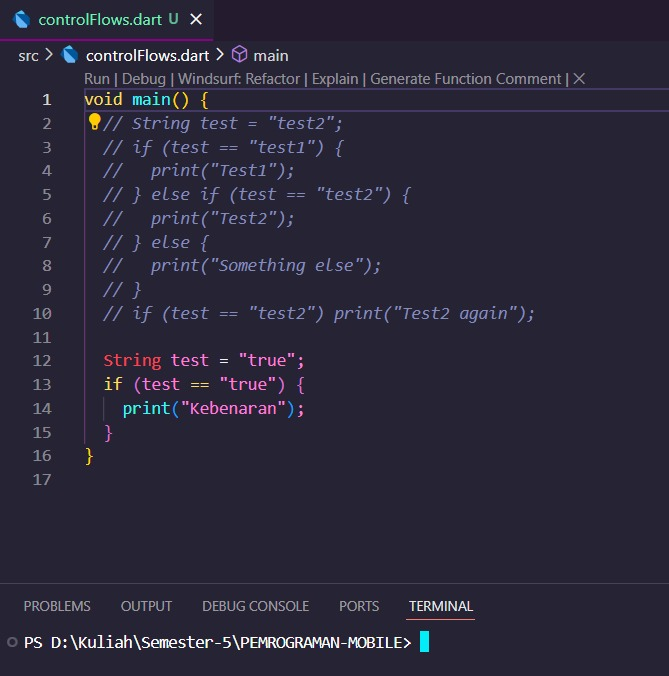

---

# 📌 Praktikum 2 – Looping (while & do while)  

### ❌ Screenshot Error
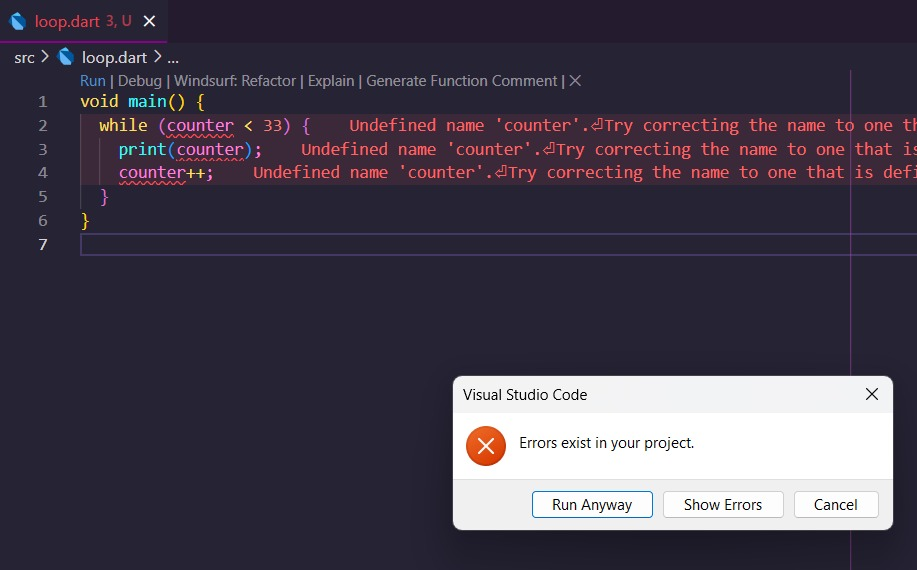

### 🔎 Penjelasan Error
Variabel `counter` tidak diinisialisasi terlebih dahulu, sehingga perulangan `while` tidak mengetahui nilai awal.  
Hal ini menyebabkan error.

### ✅ Screenshot Perbaikan
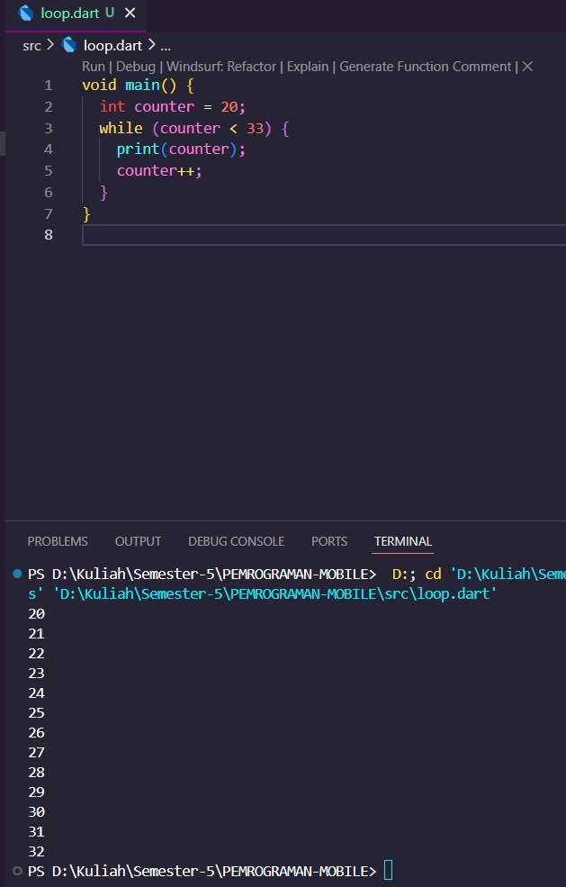

### 📸 Screenshot Hasil Praktikum
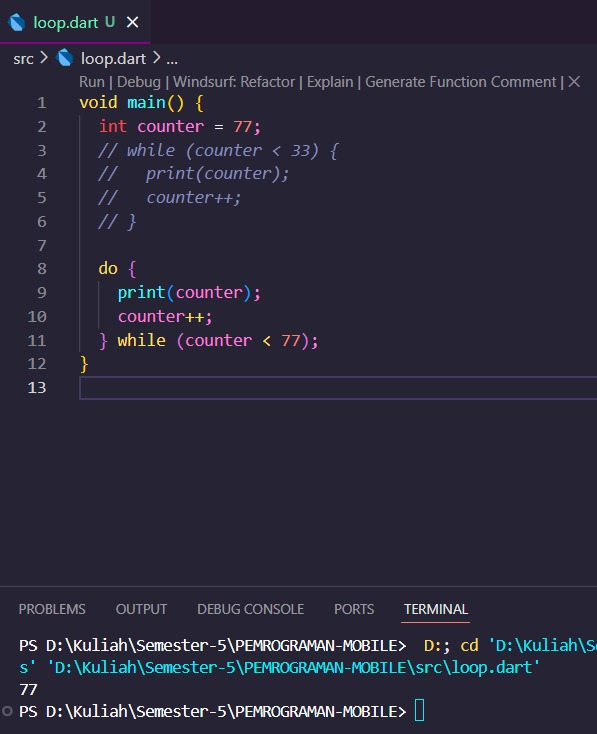

### 📖 Penjelasan
- **while** → Mengecek kondisi dulu, baru mengeksekusi kode.  
- **do-while** → Mengeksekusi kode sekali dulu, baru memeriksa kondisi.  

Contoh:  
Jika nilai awal `counter = 77`, maka:  
- Pada `do-while` → kode tetap dijalankan sekali meskipun kondisi salah.  
- Pada `while` → kode tidak akan dijalankan sama sekali.  

---

# 📌 Praktikum 3 – Kombinasi Control Flow & Looping  

### ❌ Screenshot Error
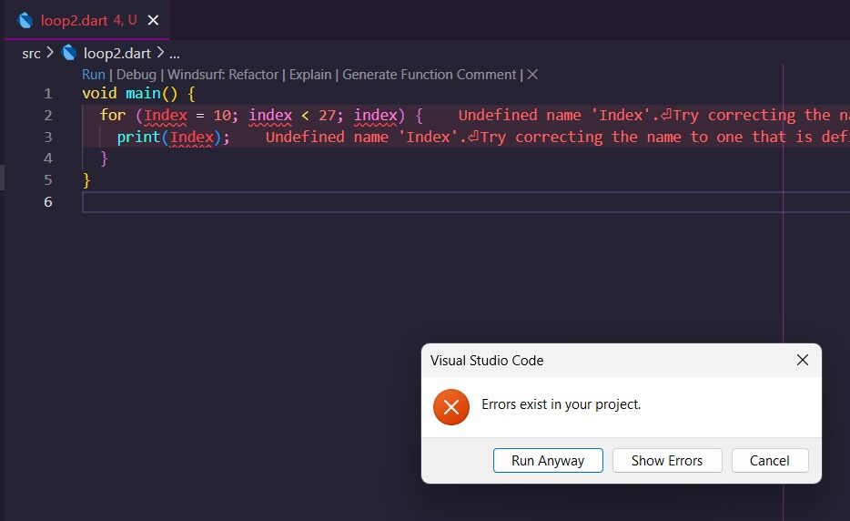

### 🔎 Penjelasan Error
Ada **dua kesalahan utama**:
1. Inkonsistensi nama variabel (huruf besar-kecil berbeda).  
2. Inisialisasi variabel yang tidak tepat.  

Dart yang bersifat **case sensitive** membuat perbedaan huruf besar/kecil bisa menimbulkan error.

### ✅ Screenshot Perbaikan
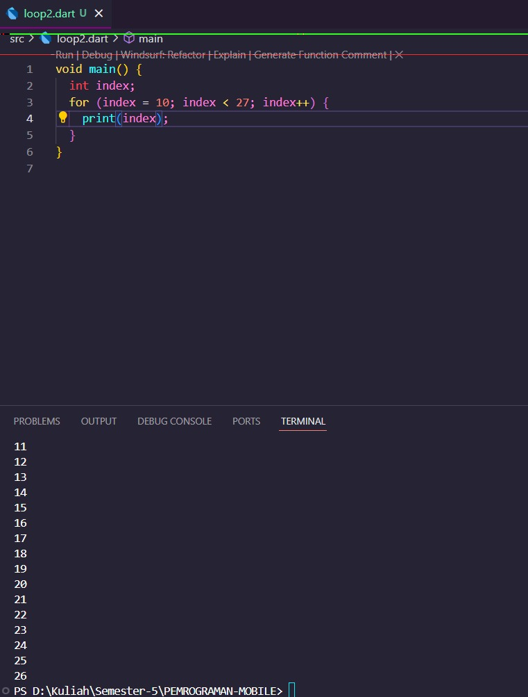

---

### ❌ Screenshot Error Lanjutan
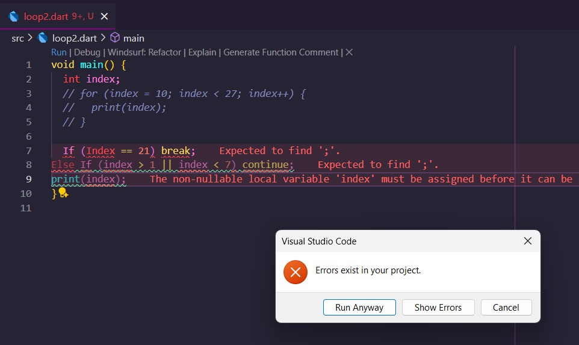

### 🔎 Penjelasan Error
Masih terjadi error karena:  
- `Else` ditulis dengan huruf besar.  
- `If` ditulis dengan huruf besar.  
- Inkonsistensi nama variabel.  
- Struktur perulangan tidak sesuai standar.  

### ✅ Screenshot Perbaikan
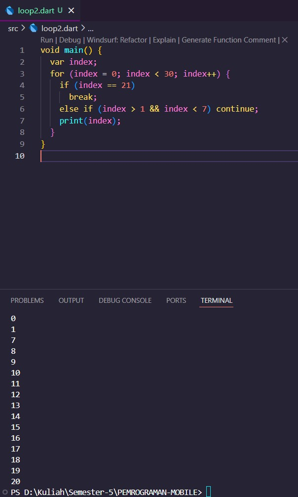

---

# 🎯 Tugas Tambahan  

### 📌 Deskripsi  
Buat program Dart untuk menampilkan **bilangan prima dari 0–201**.  
Jika bilangan prima ditemukan → tampilkan **Nama Lengkap & NIM**.  

### 📸 Screenshot Hasil  
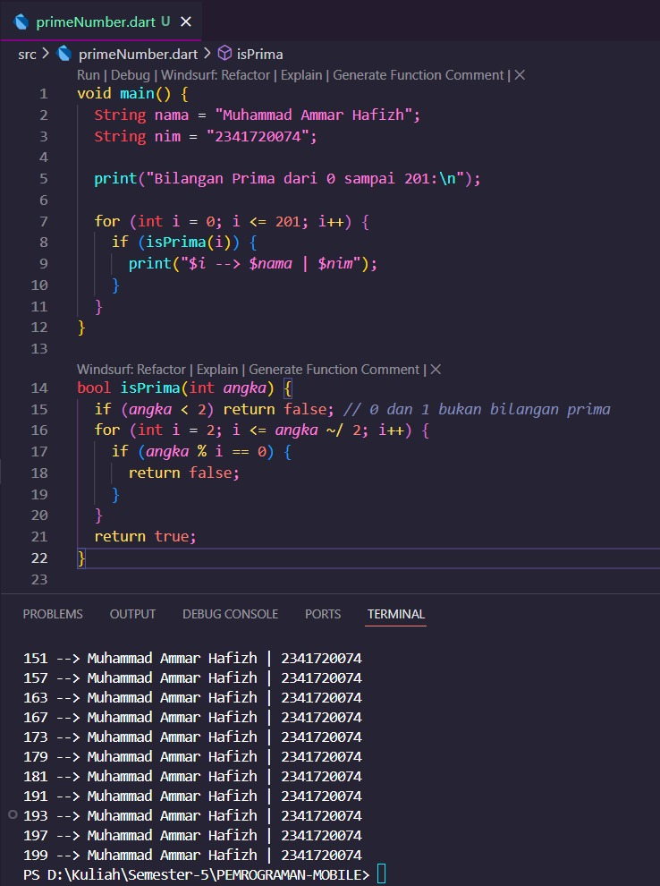  

### 📖 Cuplikan Kode
```dart
void main() {
  String nama = "Muhammad Ammar Hafizh";
  String nim = "2341720074";

  for (int i = 0; i <= 201; i++) {
    if (isPrima(i)) {
      print("$i --> $nama | $nim");
    }
  }
}

bool isPrima(int angka) {
  if (angka < 2) return false;
  for (int i = 2; i <= angka ~/ 2; i++) {
    if (angka % i == 0) return false;
  }
  return true;
}