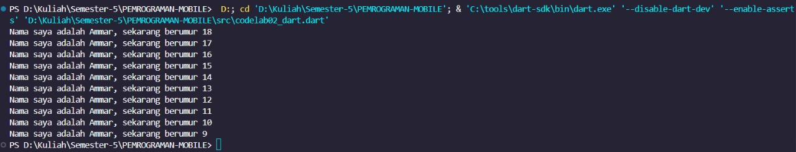
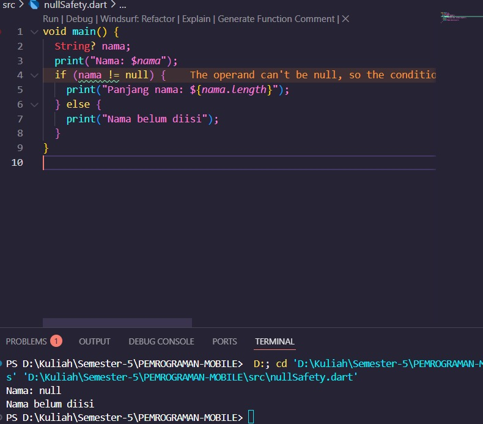
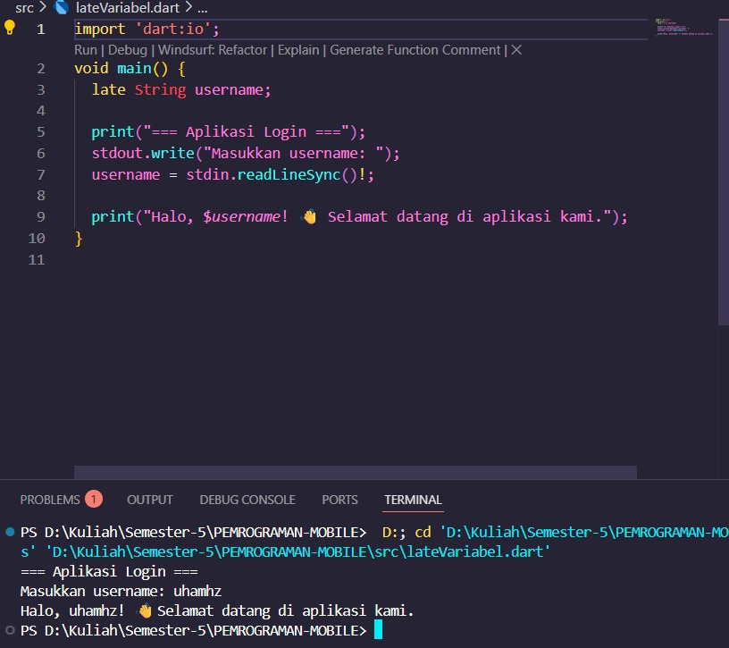

# 🚀 Codelab 02 – Dart  

## 👤 Identitas  
- **Nama** : Muhammad Ammar Hafizh  
- **NIM** : 2341720074  
- **Kelas** : TI - 3F  

---

## 📸 Bukti Screenshot Program  
  

---

## ❓ Mengapa penting memahami Dart sebelum Flutter?  
Karena **Flutter dibangun dengan bahasa Dart**, maka sangat penting bagi programmer yang ingin menggunakan framework Flutter untuk **menguasai dasar-dasar Dart terlebih dahulu**. Dengan memahami Dart, proses belajar Flutter akan lebih mudah, cepat, dan efisien.  

---

## 📝 Ringkasan Materi Codelab  

### 🔢 Arithmetic Operators  
- `+` → Penjumlahan  
- `-` → Pengurangan  
- `*` → Perkalian  
- `/` → Pembagian → hasil `double`  
- `~/` → Pembagian bilangan bulat  
- `%` → Modulus (sisa bagi)  
- `-expression` → Negasi (membalikkan nilai)  

---

### ➕ Operator Increment & Decrement  
- `++var` atau `var++` → Menambah 1  
- `--var` atau `var--` → Mengurangi 1  
📌 Umumnya digunakan pada **perulangan** untuk menghitung iterasi.  

---

### ⚖️ Operator Equality & Relational  
- `==` → Sama dengan  
- `!=` → Tidak sama dengan  
- `>`  → Lebih besar  
- `<`  → Lebih kecil  
- `>=` → Lebih besar atau sama dengan  
- `<=` → Lebih kecil atau sama dengan  

> Di Dart, `==` membandingkan **isi variabel**, bukan alamat memori.  
> Tidak ada `===` seperti di JavaScript karena Dart sudah **type-safe**.  

---

### 🔗 Operator Logical  
- `!expression` → Negasi (membalikkan nilai `true` ↔ `false`)  
- `||` → OR (salah satu bernilai `true`)  
- `&&` → AND (keduanya harus `true`)  

---

## 🎯 Kesimpulan  
Dengan memahami operator-operator dasar di Dart, kita dapat:  
- Membuat perhitungan matematis dengan mudah  
- Menulis logika percabangan yang jelas  
- Menggunakan perulangan dengan lebih efisien  
- Memahami dasar penting untuk pengembangan aplikasi mobile dengan Flutter 🚀  

## 📝 penjelasan dan contoh eksekusi kode tentang perbedaan Null Safety dan Late variabel !

### ⚠️ Null Safety
logika yang dibuat untuk pengecekan pada variable yang memastikan agar variable tersebut tidak memiliki nilai null, logika ini biasa dipakai untuk variable yang tidak diperbolehkan null.
-
#### Contoh
 

### ⚠️ Late Variabel
late variabel digunakan untuk kita membuat suatu variable tetapi dapat wajib diisi nantinya agar tidak ada error seperti sapaan aplikasi setelah kita login.
-
### Contoh
 