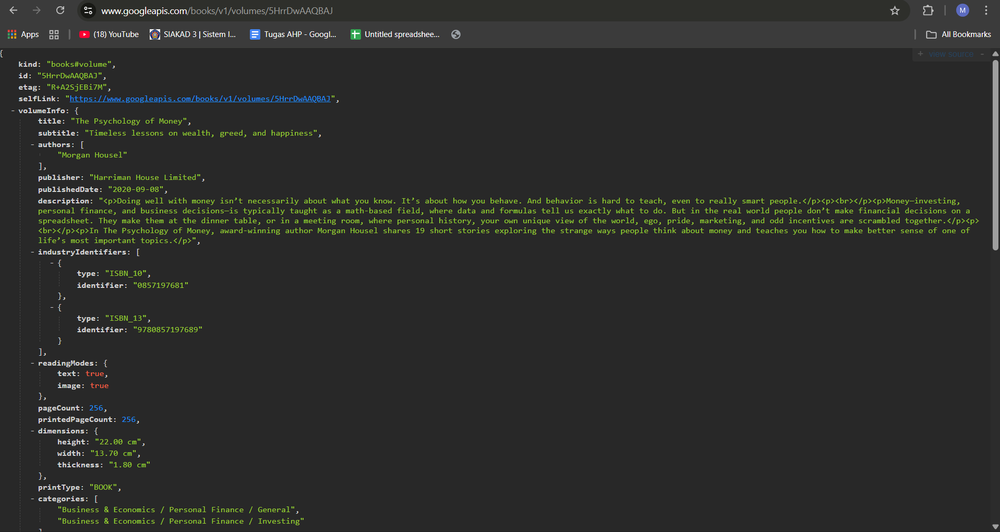

# 📝 Codelab 11 – Pemrograman Asynchronous

## 👤 Identitas
| Nama | NIM | Kelas |
|------|-----|--------|
| **Muhammad Ammar Hafizh** | 2341720074 | TI - 3F |

---

## 📌 Praktikum 1 – Mengunduh Data dari Web Service (API)

### 💡 Soal 1  
**Tambahkan nama panggilan Anda pada title app sebagai identitas hasil pekerjaan Anda.**

**🧠 Jawaban:**  
``` Widget build(BuildContext context) {
    return MaterialApp(
      title: 'Future Demo - Ammar',
      theme: ThemeData(
        primarySwatch: Colors.blue,
        visualDensity: VisualDensity.adaptivePlatformDensity,
      ),
      home: const FuturePage(),
    );
  }
```
---

### 💡 Soal 2.1  
**Carilah judul buku favorit Anda di Google Books, lalu ganti ID buku pada variabel path di kode tersebut. Caranya ambil di URL browser Anda seperti gambar berikut ini.**

**🧠 Jawaban:**  
```  Future<Response> getData() async {
    const authority = 'www.googleapis.com';
    const path = '/books/v1/volumes/5HrrDwAAQBAJ';
    final Uri url = Uri.https(authority, path);
    return http.get(url);
  }
```
  


### 💡 Soal 2.2  
**Kemudian cobalah akses di browser URI tersebut dengan lengkap seperti ini. Jika menampilkan data JSON, maka Anda telah berhasil.**

**🧠 Jawaban:**  


---

### 💡 Soal 3  
**Jelaskan maksud kode langkah 5 tersebut terkait substring dan catchError!**

**🧠 Jawaban:**  

- **`substring`**  
  .substring(0, 450) → memotong teks tersebut mulai dari indeks ke-0 sampai ke-449, jadi hanya menampilkan 450 karakter pertama. Agar data yang ditampilkan ke layar tidak terlalu panjang (karena response JSON bisa sangat besar).
 Misalnya, kalau body berisi 10.000 karakter, hanya 450 karakter pertama yang diambil untuk pratinjau cepat.

- **`catchError`**  
  Menampilkan pesan 'An error occurred' agar pengguna tahu bahwa ada kegagalan saat memuat data.
 Pemanggilan setState() memastikan teks hasil (result) yang ditampilkan di UI ikut diperbarui.

---

### ✅ Bukti Praktikum 1  


---

## 📌 Praktikum 2 – Menggunakan await/async untuk menghindari callbacks

### 💡 Soal 1  
**Jelaskan maksud kode langkah 1 dan 2 tersebut!**

**🧠 Jawaban:**  

- **`Langkah Pertama`**  
   Pada langkah pertama kita membuat tiga method asyncronus dan tiap method memiliki delay 3 detik tetapi memiliki nilai return yang berbeda beda 1,2 dan 3

- **`Langkah Kedua`**  
   dan pada method count yang akan dipanggil saat user menekan tombol go dan pada method count dimulai dari var total yaitu 0 dan menunggu tiap method async return 1 2 3 terpanggil dengan waktu delay 9 detik dan nilai returnnya 6 yang akan ditampilkan pada ui 

---

### ✅ Bukti Praktikum 2  


---

## 📌 Praktikum 3 – Menggunakan Completer di Future

### 💡 Soal 1  
**Jelaskan maksud kode langkah 2 tersebut!**

**🧠 Jawaban:**  

- **`getNumber`**  
   getNumber() langsung mengembalikan Future yang belum selesai.
   Tapi 5 detik kemudian, Future itu akan selesai dan memberikan nilai 42.

- **`calculate`**  
   Future yang dikembalikan oleh getNumber() sekarang dianggap selesai (completed), dengan hasil nilai 42.

---

### ✅ Bukti Praktikum 3 Langkah 4


### 💡 Soal 2  
**Jelaskan maksud perbedaan kode langkah 2 dengan langkah 5-6 tersebut!**

**🧠 Jawaban:**  
   logika method masih sama saja tetapi pada method yang sudah diperbarui memiliki try catch error yang dapat menampilkan pesan saat ada error 

### ✅ Bukti Praktikum 3


---

## 📌 Praktikum 4 – Memanggil Future secara paralel

### 💡 Soal 1  
**Jelaskan maksud perbedaan kode langkah 1 dan 4!**

**🧠 Jawaban:**  

- **`FutureGroup`**  
   Future group dipakai ketika kita ingin menambah future secara dinamis sebelum close dipanggil 

- **`Future.wait`**  
   Semua future dijalankan secara pararel atau semua method langsung berjalan bersamaan 

---

### ✅ Bukti Praktikum 4


---

## 📌 Praktikum 5 – Menangani Respon Error pada Async Code

### 💡 Soal 1  
**Panggil method handleError() tersebut di ElevatedButton, lalu run. Apa hasilnya? Jelaskan perbedaan kode langkah 1 dan 4!**

**🧠 Jawaban:**  

- **`handleError`**  
   Menangani error menggunakan try catch agar error tidak menyebabkan crash di program mengganti error dengan teks lain

- **`returnError`**  
   Kebalikan dari handleError jika dipakai pada aplikasi dan ada error maka aplikasi akan crash 

---

### ✅ Bukti Praktikum 5


---