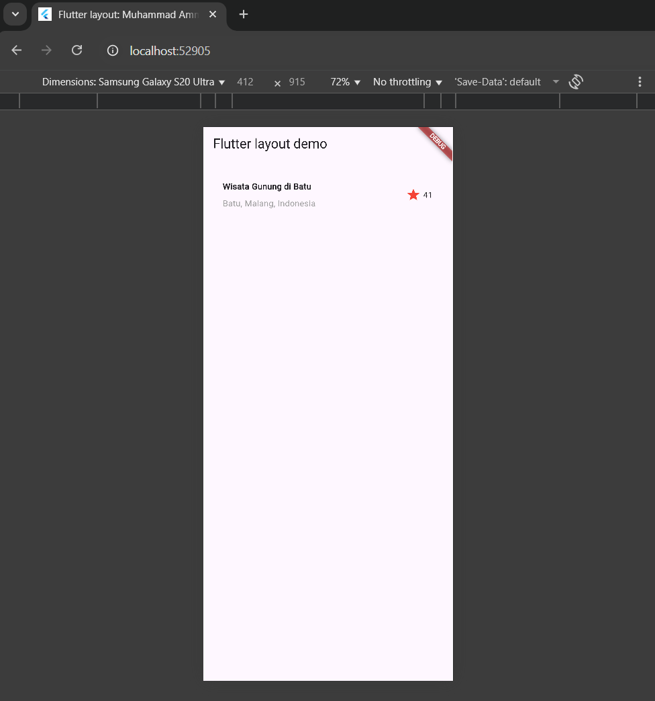
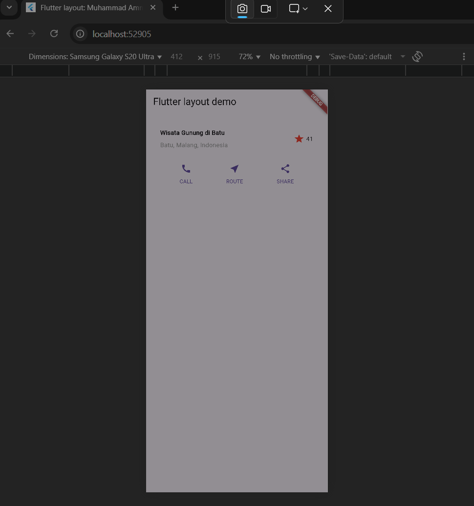
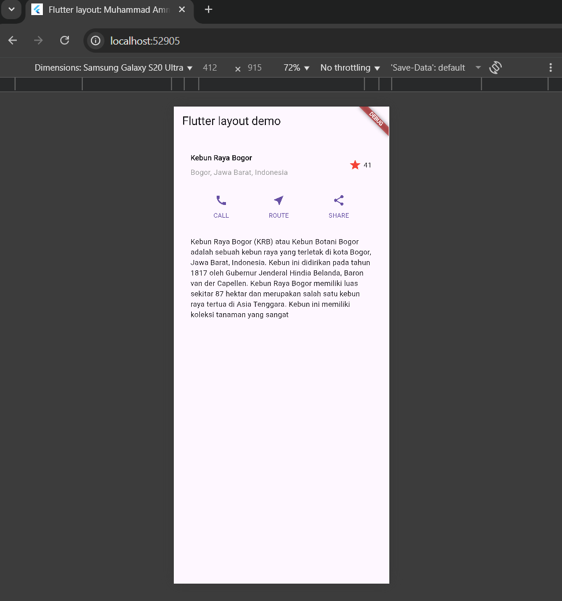
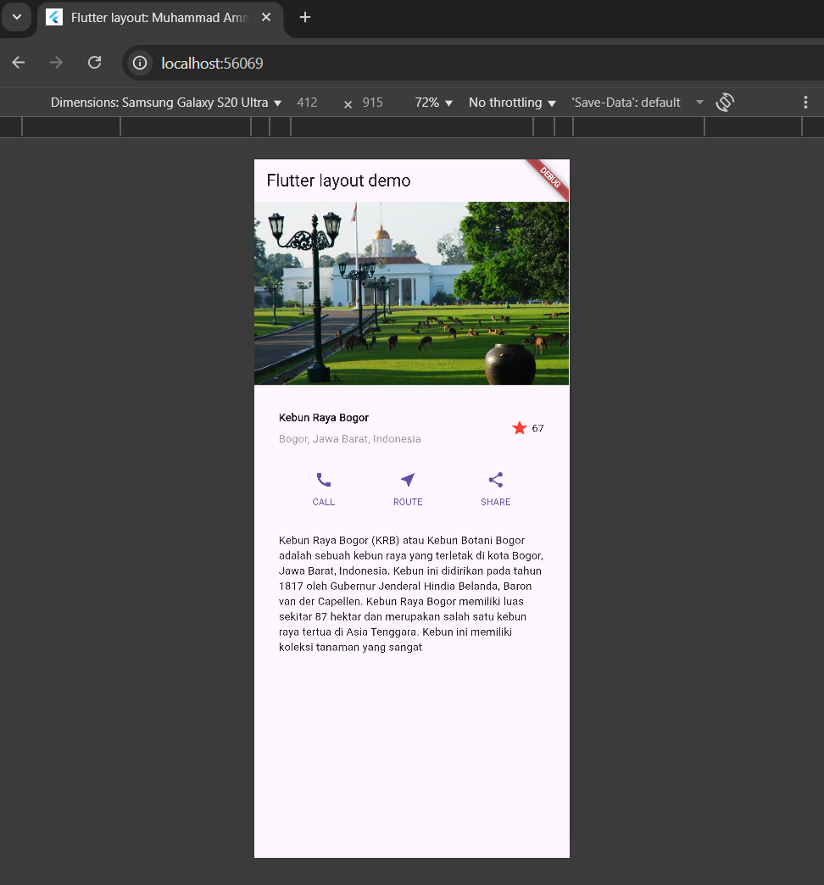
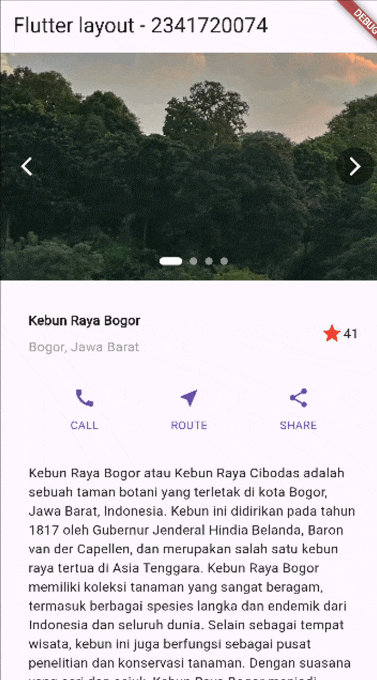

# 📝 Codelab 06 - Layout

## 👤 Identitas
- **Nama**  : Muhammad Ammar Hafizh  
- **NIM**   : 2341720074  
- **Kelas** : TI - 3F  

---

# 📌 Praktikum 1 – Membangun Layout di Flutter

### ✅ Screenshot Praktikum 1

### Penjelasan Praktikum 1
pada praktikum 1 kita diminta untuk bisa membedakan row dan column dan hasil praktikum 1 ada pada gambar di atas

# 📌 Praktikum 2 – Implementasi button row

### ✅ Bukti Praktikum 2

### Penjelasan Praktikum 2
pada praktikum 2 kita diminta untuk membuat row button seperti pada gambar di atas kita membuat row button dan row text yang membuat button call, route, share.

# 📌 Praktikum 3 – Implementasi text section

### ✅ Bukti Praktikum 3

### Penjelasan Praktikum 3
pada praktikum 3 kita diminta untuk membuat text section yang pada di gambar di atas adalah deskripsi yang kita buat

# 📌 Praktikum 4 – Implementasi image section

### ✅ Bukti Praktikum 4

### Penjelasan Praktikum 4
pada praktikum 4 kita diminta untuk memuat image section yang ada pada gambar di atas.

# 🎯 Tugas Tambahan  

# 📌 Tugas – Codelabs: Your first Flutter app

### ✅ Screenshot Tugas

### 🔎 Repository
[Link Repository](https://github.com/uhamhz/basic_layout_flutter/tree/main/basic_layout_flutter)

