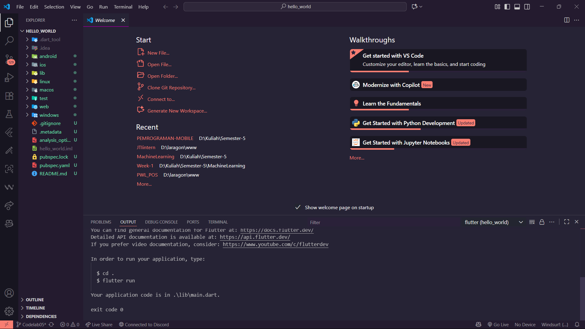
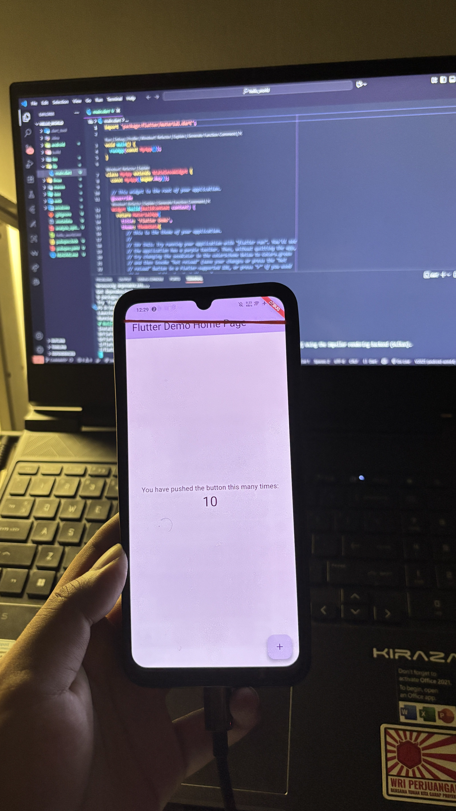
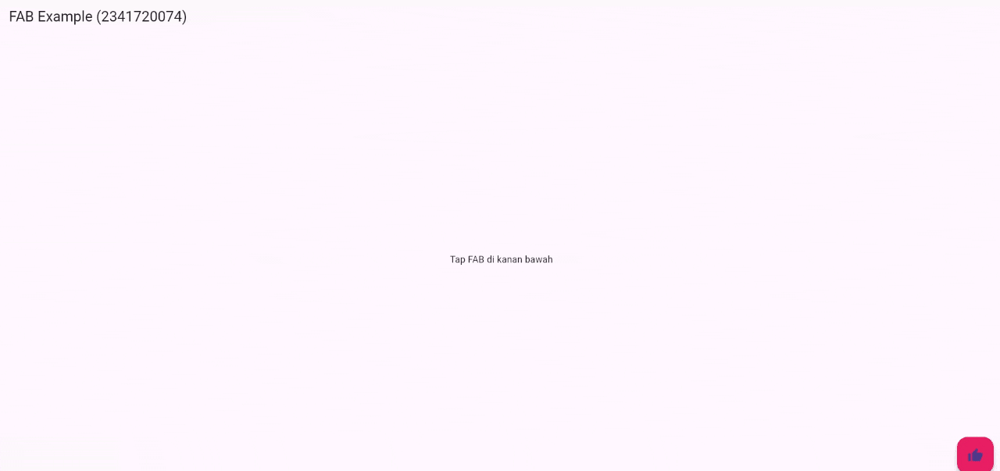
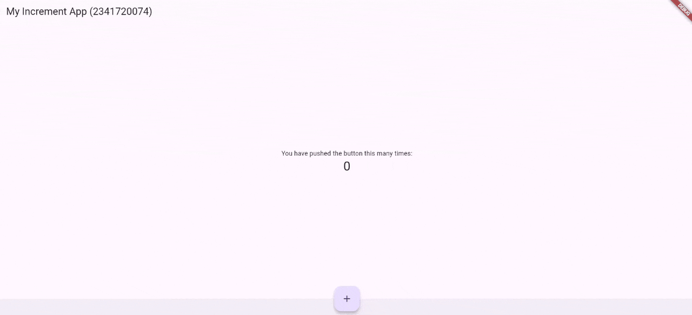
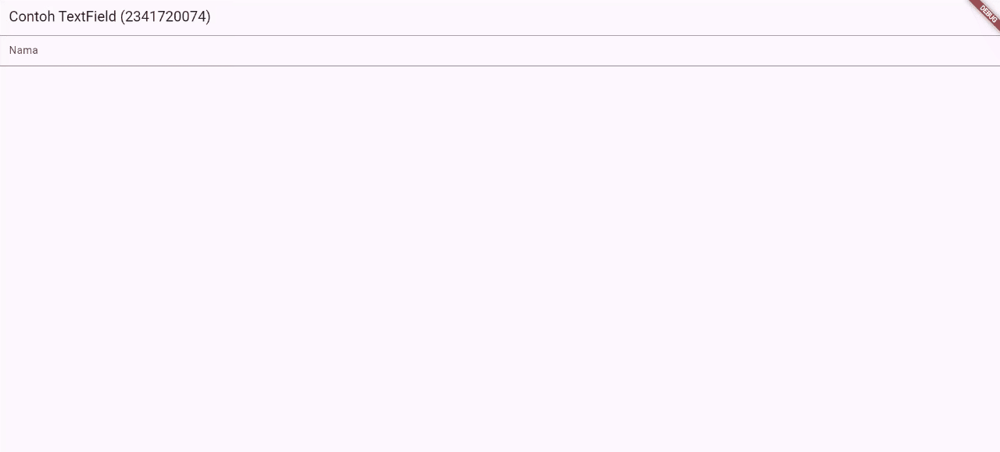
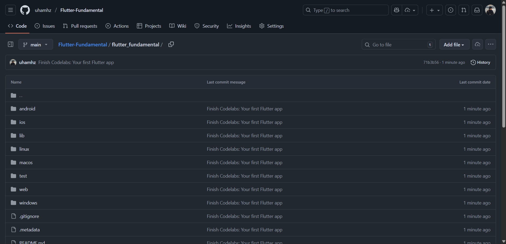

# 📝 Codelab 05 - Flutter

## 👤 Identitas
- **Nama**  : Muhammad Ammar Hafizh  
- **NIM**   : 2341720074  
- **Kelas** : TI - 3F  

---

# 📌 Praktikum 1 – Membuat Project Flutter

### ✅ Screenshot Praktikum 1

# 📌 Praktikum 2 – Menghubungkan pada perangkat fisik

### ✅ Bukti Praktikum 2

# 📌 Praktikum 3 – Import Widgets

### ✅ Screenshot Cupertino

### ✅ Screenshot Floating Action Button

### ✅ Screenshot Scaffold Widget

### ✅ Screenshot Dialog Widget

### ✅ Screenshot Input dan Selection Widget

### ✅ Date and Time Pickers

# 🎯 Tugas Tambahan  

# 📌 Tugas – Codelabs: Your first Flutter app

### ✅ Screenshot Praktikum 4

### 🔎 Repository
[Link Repository](https://github.com/uhamhz/Flutter-Fundamental/tree/main/flutter_fundamental)

