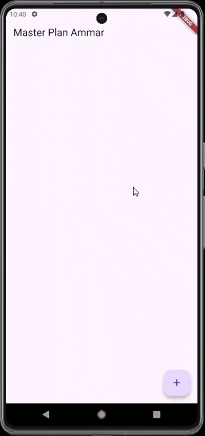
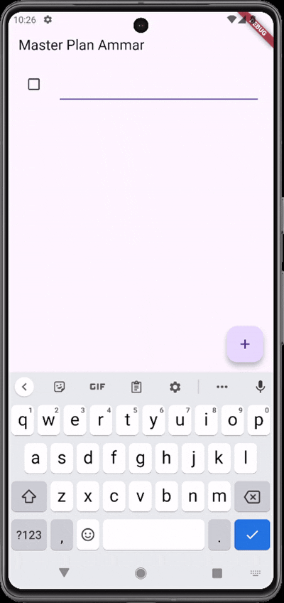
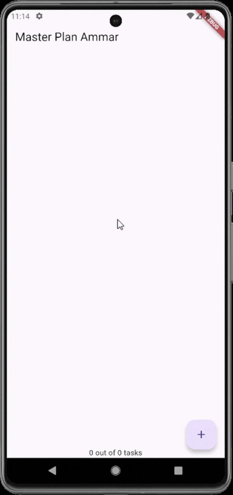
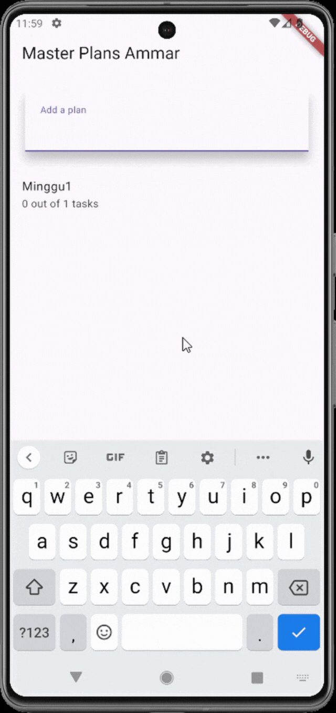
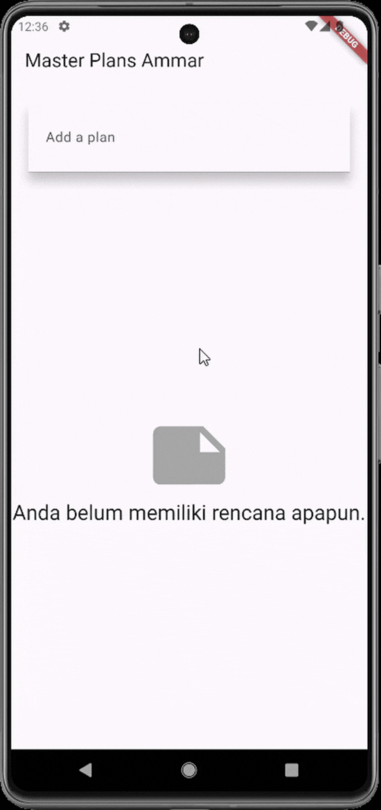

# 📝 Codelab 09 – Master Plan

## 👤 Identitas
| Nama | NIM | Kelas |
|------|-----|--------|
| **Muhammad Ammar Hafizh** | 2341720074 | TI - 3F |

---

## 📌 Praktikum 1 – Dasar State dengan Model View

### 💡 Soal 1  
**Jelaskan maksud dari langkah 4 pada praktikum tersebut! Mengapa dilakukan demikian?**

**🧠 Jawaban:**  
Langkah 4 berfungsi sebagai penghubung antar file di folder `models`.  
Setiap file di dalam `models` harus diimpor melalui `data_layer.dart` agar mudah digunakan kembali.  
Dengan cara ini, ketika ingin menggunakan model apa pun, cukup mengimpor `data_layer.dart` saja tanpa perlu mengimpor tiap file satu per satu.

---

### 💡 Soal 2  
**Mengapa perlu variabel `plan` di langkah 6 pada praktikum tersebut? Mengapa dibuat konstanta?**

**🧠 Jawaban:**  
Variabel `plan` digunakan untuk menyimpan data model rencana (`Plan`) yang akan ditampilkan pada `PlanScreen`.  
Variabel tersebut dibuat sebagai **konstanta** karena sifat datanya masih statis (belum berubah) sehingga lebih efisien dan aman dari perubahan nilai yang tidak disengaja.

---

### 💡 Soal 3  
**Lakukan capture hasil dari Langkah 9 berupa GIF, kemudian jelaskan apa yang telah Anda buat!**

**🧠 Jawaban:**  
  
Pada langkah ini dibuat **checkbox** untuk setiap item plan, lengkap dengan teks deskripsinya.  
Tujuannya agar pengguna dapat menandai tugas mana yang telah selesai dikerjakan.

---

### 💡 Soal 4  
**Apa kegunaan method pada Langkah 11 dan 13 dalam lifecycle state?**

**🧠 Jawaban:**  

- **`initState()`**  
  Merupakan tahap pertama saat `State` baru dibuat.  
  Method ini dipanggil **sekali saja** sebelum widget pertama kali ditampilkan.  
  Biasanya digunakan untuk inisialisasi data atau proses awal.

- **`dispose()`**  
  Adalah tahap terakhir dari lifecycle widget.  
  Method ini dipanggil ketika widget **dihapus dari widget tree**, misalnya saat pindah halaman.  
  Fungsinya untuk membersihkan resource, seperti controller atau listener.

---

### ✅ Bukti Praktikum 1  


---

## 📌 Praktikum 2 – Mengelola Data Layer dengan InheritedWidget & InheritedNotifier

### 💡 Soal 1  
**Jelaskan mana yang dimaksud InheritedWidget pada langkah 1 tersebut! Mengapa yang digunakan InheritedNotifier?**

**🧠 Jawaban:**  
```dart
class PlanProvider extends InheritedNotifier<ValueNotifier<Plan>> {
  const PlanProvider({
    super.key,
    required Widget child,
    required ValueNotifier<Plan> notifier,
  }) : super(child: child, notifier: notifier);

  static ValueNotifier<Plan> of(BuildContext context) {
    return context
        .dependOnInheritedWidgetOfExactType<PlanProvider>()!
        .notifier!;
  }
}
```

`PlanProvider` berfungsi menurunkan data (`Plan`) ke seluruh widget tree.  
Namun karena data tersebut juga **perlu memicu pembaruan (notify)** saat berubah, maka digunakan `InheritedNotifier` — turunan dari `InheritedWidget` yang memiliki kemampuan pemberitahuan perubahan data otomatis ke widget lain.

---

### 💡 Soal 2  
**Jelaskan maksud dari method di langkah 3 pada praktikum tersebut! Mengapa dilakukan demikian?**

**🧠 Jawaban:**  
Method `completedCount` dan `completenessMessage` digunakan untuk:
- Menghitung jumlah tugas yang telah selesai
- Menampilkan pesan progres penyelesaian secara otomatis  

Getter ini dibuat di dalam model agar logika perhitungan dipisahkan dari tampilan, sehingga kode menjadi **lebih bersih, reusable, dan konsisten** di seluruh aplikasi.

---

### 💡 Soal 3  
**Lakukan capture hasil dari Langkah 9 berupa GIF, kemudian jelaskan apa yang telah Anda buat!**

**🧠 Jawaban:**  
  
Langkah ini menambahkan teks yang menampilkan **jumlah task yang sudah diselesaikan** dari total keseluruhan task, memberikan umpan balik progres kepada pengguna.

---

### ✅ Bukti Praktikum 2  


---

## 📌 Praktikum 3 – Membuat State di Multiple Screens

### 💡 Soal 1  
**Berdasarkan Praktikum 3 yang telah Anda lakukan, jelaskan maksud dari gambar diagram berikut!**

**🧠 Jawaban:**  
Diagram menunjukkan **alur navigasi dan manajemen state** dalam aplikasi *Plan App*.  

- **PlanCreatorScreen** (kiri): menampilkan daftar plan dan memungkinkan pengguna menambah plan baru melalui `TextField`.  
- **PlanScreen** (kanan): menampilkan daftar tugas dalam plan yang dipilih.  
- **PlanProvider**: menyimpan dan membagikan data `List<Plan>` antar halaman.  
- **MaterialApp**: menjadi root dari keseluruhan aplikasi.  

Struktur ini menunjukkan penerapan **InheritedNotifier** sebagai manajemen state lintas layar serta navigasi menggunakan `Navigator.push()`.

---

### 💡 Soal 2  
**Lakukan capture hasil dari Langkah 14 berupa GIF, kemudian jelaskan apa yang telah Anda buat!**

**🧠 Jawaban:**  
  
Pada langkah ini, aplikasi menambahkan **halaman utama (home)** sebelum masuk ke daftar plan.  
Pengguna harus membuat **master plan terlebih dahulu** sebelum dapat menambahkan atau mengelola daftar tugas.

---

### ✅ Bukti Praktikum 3  


---