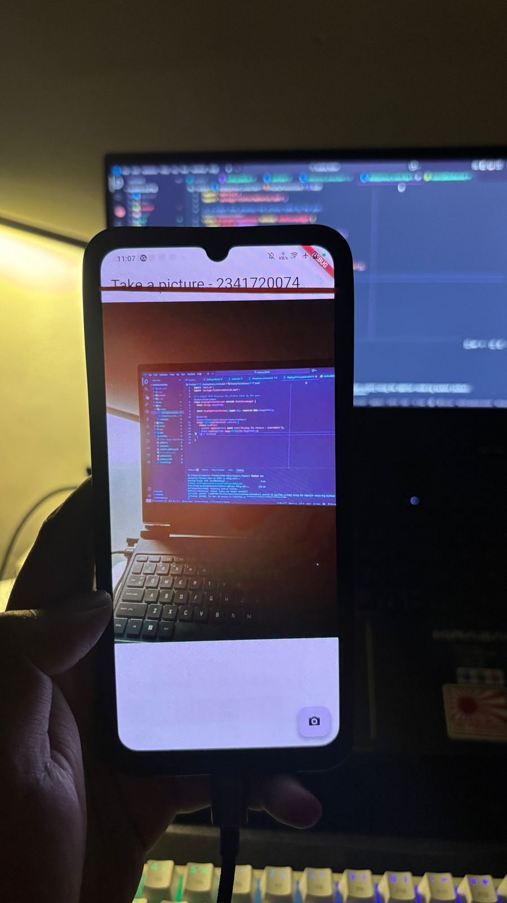

# 📝 Codelab 09 - Kamera

## 👤 Identitas
- **Nama**  : Muhammad Ammar Hafizh  
- **NIM**   : 2341720074  
- **Kelas** : TI - 3F  

---

# 📌 Praktikum 1 – Mengambil Foto dengan Kamera di Flutter

### ✅ Bukti Praktikum 1

### ✅ Bukti Praktikum 1

### Penjelasan Praktikum 1
pada praktikum 1 kita diminta untuk bisa membuat akses kamera pada aplikasi yang kita buat dan mengaktifkan persyaratan untuk bisa membuka kamera di aplikasi tersebut.

# 📌 Praktikum 2 – Membuat photo filter carousel

### ✅ Bukti Praktikum 2

### Penjelasan Praktikum 2
pada praktikum 2 kita diminta untuk membuat carousel filter yang bisa mengganti gambar preview yang sudah kita tetapkan juga

# 📌 Tugas – Codelabs: Membuat aplikasi kamera dengan filter carousel

### ✅ Screenshot Tugas

### 🔎 Repository Repo Praktikum 1
[Link Repository](https://github.com/uhamhz/PEMROGRAMAN-MOBILE/tree/Codelab09/kamera_flutter)

