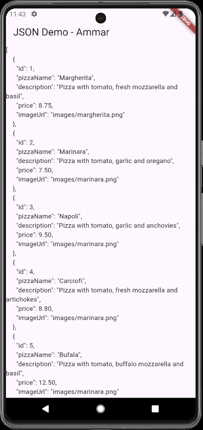
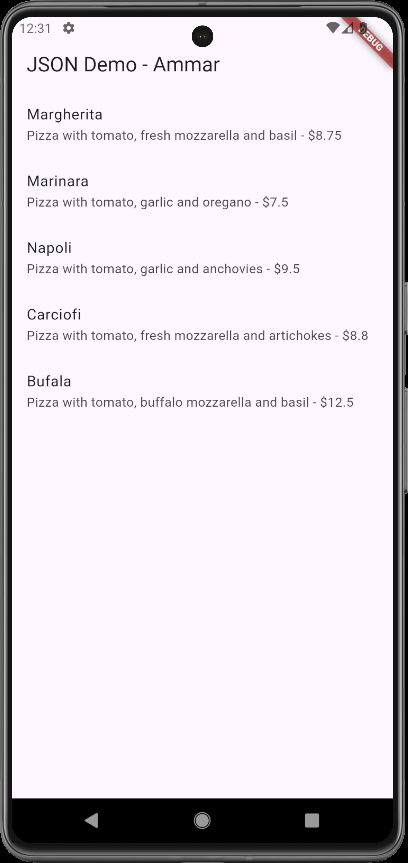
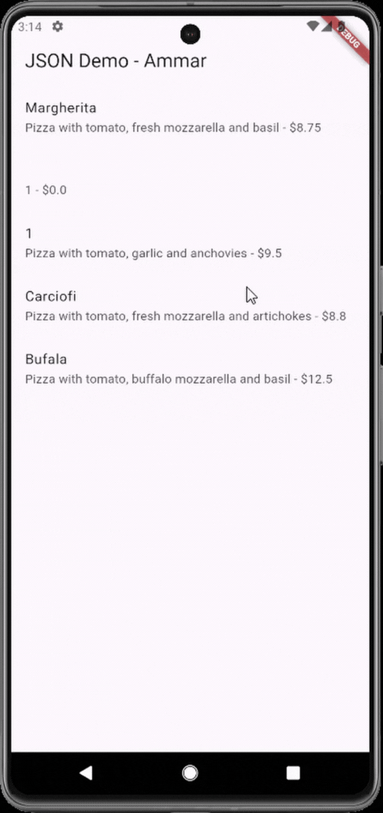
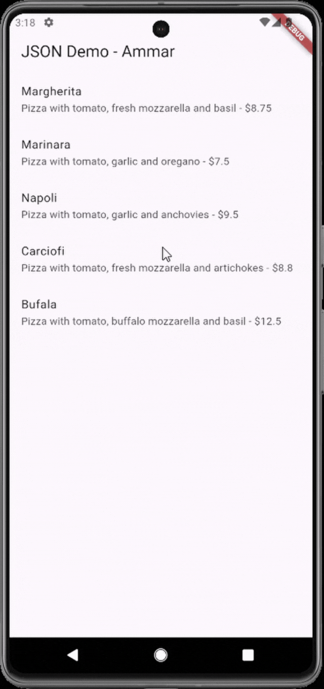
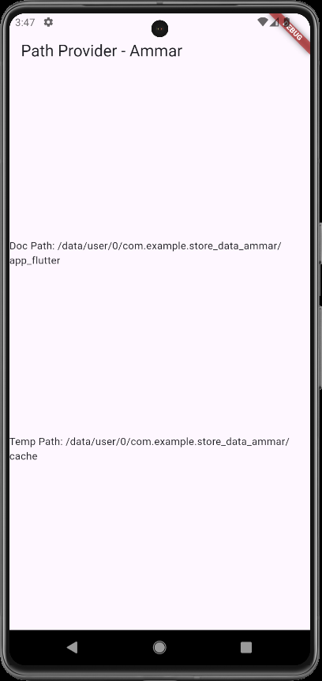
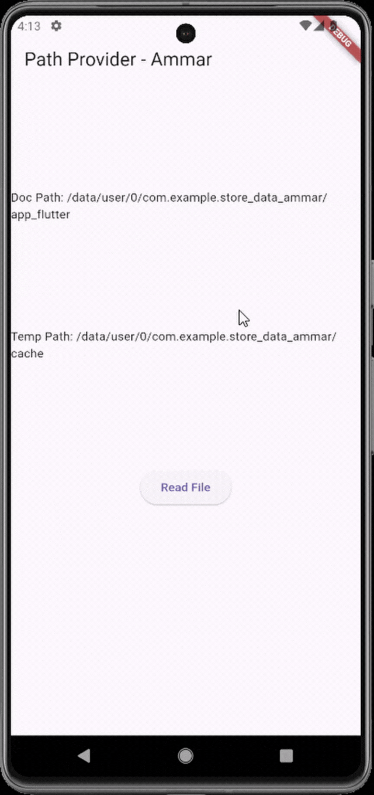
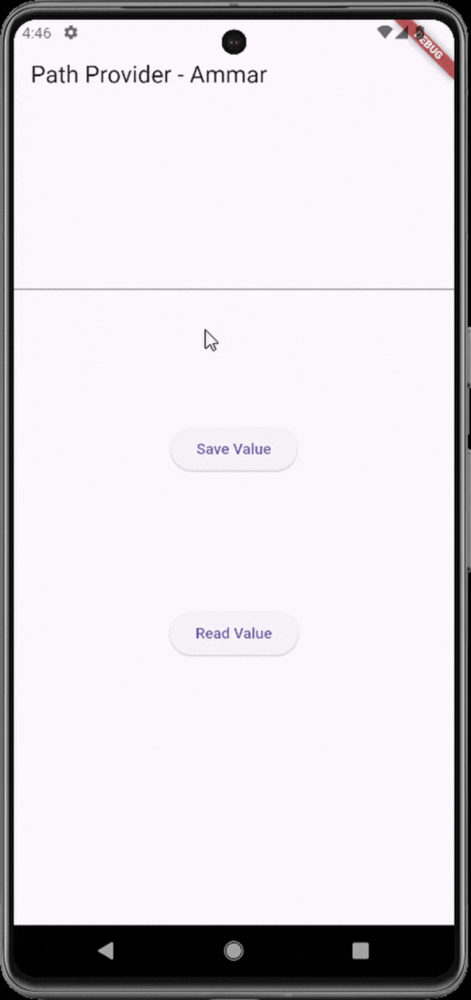

# 📝 Codelab 13 – Persistensi Data
## 👤 Identitas
| Nama | NIM | Kelas |
|------|-----|--------|
| **Muhammad Ammar Hafizh** | 2341720074 | TI - 3F |

---

## 📌 Praktikum 1 – Dart Streams

### 💡 Soal 1  
**Tambahkan nama panggilan Anda pada title app sebagai identitas hasil pekerjaan Anda.**

**🧠 Jawaban:**  
``` 
 Widget build(BuildContext context) {
    return MaterialApp(
      title: 'Flutter JSON Demo - Ammar',
      theme: ThemeData(primarySwatch: Colors.blue),
      home: const MyHomePage(),
    );
  }
```
---

### 💡 Soal 1.2
**Gantilah warna tema aplikasi sesuai kesukaan Anda.**

**🧠 Jawaban:**  
```  
Widget build(BuildContext context) {
    return MaterialApp(
      title: 'Flutter JSON Demo - Ammar',
      theme: ThemeData(primarySwatch: Colors.deepPurple),
      home: const MyHomePage(),
    );
  }
```
---

### 💡 Soal 2  
**Masukkan hasil capture layar ke laporan praktikum Anda.**

**🧠 Jawaban:**  

### ✅ Bukti Praktikum 1  


---

### 💡 Soal 3  
**Masukkan hasil capture layar ke laporan praktikum Anda.**

**🧠 Jawaban:**  

### ✅ Bukti Praktikum 2 


---

### 💡 Soal 3.2  
**Apa maksud isi perintah kode tersebut?**

**🧠 Jawaban:**  

Kode tersebut membuat stream yang memancarkan warna dari daftar colors, berubah setiap 1 detik, dan terus berulang tanpa henti.

---

### 💡 Soal 4  
**Capture hasil praktikum Anda berupa GIF dan lampirkan di README.**

**🧠 Jawaban:**  

### ✅ Bukti Praktikum 2.1  


---
### 💡 Soal 5  
**Jelaskan maksud kode lebih safe dan maintainable!**

**🧠 Jawaban:**  

- **`Konstanta Key JSON`**  
   Pendekatan ini membuat kode lebih mudah dirawat, karena jika suatu saat API mengubah nama field, developer hanya perlu mengganti di satu tempat, bukan di seluruh class. Selain itu, penggunaan konstanta mengurangi risiko kesalahan penulisan (typo).

---

### 💡 Soal 5.2  
**Capture hasil praktikum Anda berupa GIF dan lampirkan di README.**

**🧠 Jawaban:**  

### ✅ Bukti Praktikum 3  


---

### 💡 Soal 6
**Capture hasil praktikum Anda berupa GIF dan lampirkan di README.**

**🧠 Jawaban:**  

### ✅ Bukti Praktikum 4  


---

### 💡 Soal 7
**Capture hasil praktikum Anda dan lampirkan di README.**

**🧠 Jawaban:**  

### ✅ Bukti Praktikum 5  


---

### 💡 Soal 8
**Jelaskan maksud kode pada langkah 3 dan 5 !**

**🧠 Jawaban:**  

- **`Langkah 3`**  
   Fungsi writeFile() digunakan untuk melakukan proses penyimpanan data ke dalam sebuah file secara asynchronous. Di dalam fungsi ini, aplikasi mencoba menuliskan sebuah teks berupa daftar nama pizza ke dalam file yang telah ditentukan sebelumnya. Proses penulisan dilakukan menggunakan metode writeAsString(), yang secara otomatis membuat file jika belum ada atau menimpa isinya jika sudah ada.

   Untuk menjaga agar aplikasi tetap stabil, fungsi ini dibungkus di dalam blok try–catch. Jika proses penulisan berhasil, fungsi akan mengembalikan nilai true. Sebaliknya, jika terjadi kesalahan—misalnya file tidak dapat diakses atau penyimpanan gagal—fungsi akan menangkap error tersebut dan mengembalikan false. Dengan cara ini, fungsi writeFile() memastikan proses penulisan data ke file berjalan dengan aman tanpa membuat aplikasi berhenti secara tiba-tiba.

- **`Langkah 5`**  
   Fungsi readFile() berfungsi untuk mengambil kembali isi data yang telah disimpan dalam file. Proses pembacaan file dilakukan menggunakan readAsString(), yang mengembalikan seluruh isi file dalam bentuk string. Setelah berhasil dibaca, isi file tersebut disimpan ke dalam variabel state fileText melalui setState(), sehingga tampilan aplikasi akan diperbarui dan pengguna dapat melihat isi file secara langsung pada UI.

   Sama seperti fungsi sebelumnya, readFile() juga menggunakan blok try–catch untuk mencegah aplikasi mengalami error saat membaca file. Jika pembacaan berhasil, fungsi mengembalikan nilai true; tetapi jika file tidak ditemukan atau terjadi kesalahan lain, fungsi akan mengembalikan false. Dengan demikian, fungsi ini memastikan bahwa proses membaca file dilakukan dengan aman sekaligus memperbarui tampilan aplikasi.

---

### 💡 Soal 8.1
**Capture hasil praktikum Anda berupa GIF dan lampirkan di README.**

**🧠 Jawaban:**  

### ✅ Bukti Praktikum 6  


---

### 💡 Soal 9
**Capture hasil praktikum Anda berupa GIF dan lampirkan di README.**

**🧠 Jawaban:**  

### ✅ Bukti Praktikum 7  


---
